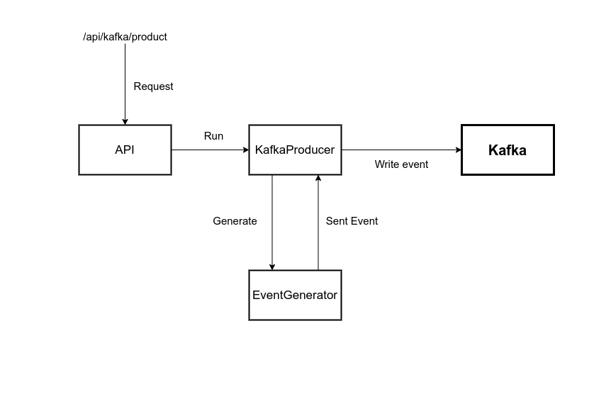

## Event Simulator

Generates an event and write to Kafka.

An event is a combination of `product_id`, `user_id`, `timestamp`.

The `product_id` is generated from the `products` table in PostgreSQL. A random number is generated from the row count of the products table. This generated number specifies which row will be used to generate the product_id.

The `user_id` is generated from a value you specify. For example if userCount is 255 generated random number between 1 and 255. ANd then this generated value become user_id.

The `timestamp` is the event created date.

## Diagram

